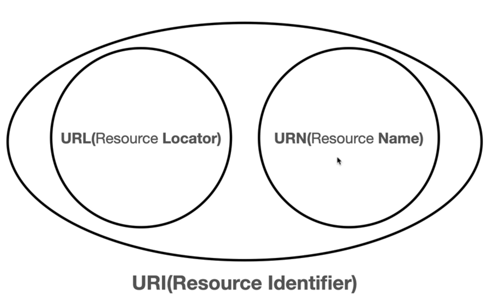

## URI
  
- Uniform: 리소스 식별하는 통일된 방식

- Resource: 자원, URI로 식별할 수 있는 모든 것

- Identifier: 다른 항목과 구분하느대 필요한 정보

- URL -  Locator: 리소스가 있는 위치를 지정 

- URN - Name: 리소스에 이름을 부여

## URL의 전체 문법
- scheme://[userinfo@]host[:port][/path][?query][#fragment]
- https://www.google.com:433/search?q=hello&hl=ko
- 프로토콜 (https)
- 호스트명(www.google.com)
- 포트 번호(443)
- 패스(/search)
- 쿼리 파라미터(q=hello&hl=ko)

### scheme
- 주로 프로토콜 사용
- 프로토코리: 어떤 방식으로 자원에 접근한 것인가 하는 약속 규칙
- http는 80포트, https는 443 포트를 주로 사용, 포트는 생략 가능
- https는 http에 보안 추가

### userinfo
- URL에 사용자 정보를 포함해서 인증
- 거의 사용하지 않느다

### host
- 호스트명
- 도메인명 또는 IP 주소를 직접 사용가능

### port
- 포트(PORT)
- 접속 포트
- 일반적으로 생략, 생략시 HTTP는80, HTTPS는 443

### path
- 리소스 경로, 계층적 구조
- home/file1.jpg
- /members
- /members/100, /items/iphone12

### query
- key=value 형태
- ?로 시작, &로 추가 가능
- query parameter, query srting 등으로 불림
```toc

```